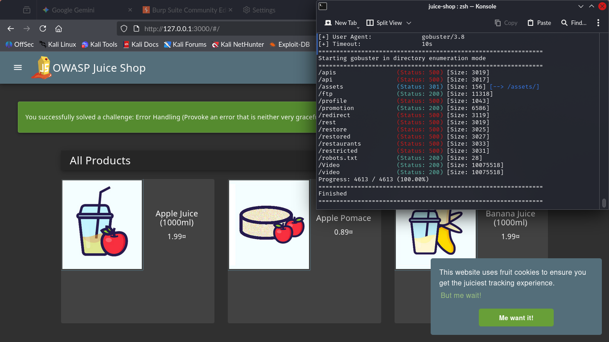
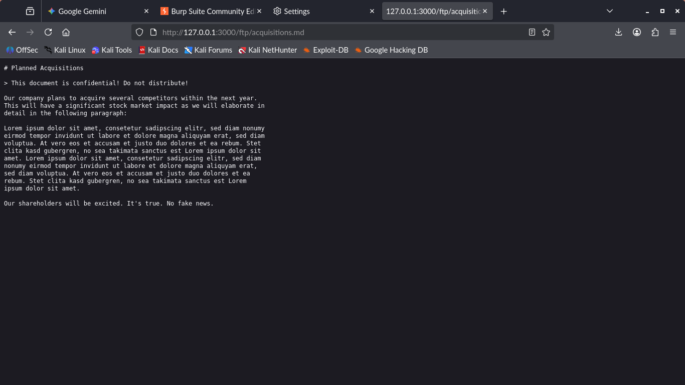

# 📂 ADVANCED 01: Sensitive Data Exposure (Open FTP)

## 🎯 Goal
Enumerate hidden directories and exploit improper access controls to retrieve internal documentation and identify critical security assets on the OWASP Juice Shop.

## 🛠️ Methodology
The attack utilized active enumeration to discover unlinked directories. While a strict file extension filter prevented downloading configuration backups directly (`.bak`), the access control flaw allowed the exfiltration of sensitive internal memos via allowed extensions (`.md`).

### Key Steps
1.  **Enumeration:** Used **Gobuster** (with length filtering) to discover the hidden `/ftp` directory.
2.  **Vulnerability Identification:** The directory has **Directory Listing enabled**, exposing the existence of critical files like `incident-support.kdbx` (Password Database) and `package.json.bak`.
3.  **Exploitation:** Bypassed the `.md/.pdf` extension filter by targeting allowed confidential documents.

---

## 🔍 Key Findings

### 1. Critical Information Disclosure
The directory listing reveals the location of the organization's password database and source code backups.
* **Critical Asset:** `incident-support.kdbx` (KeePass Database - High Value Target).

### 2. Confidential Document Exfiltration
Successfully accessed internal business documentation.
* **Payload:** `/ftp/acquisitions.md`
* **Impact:** Leakage of sensitive business strategy regarding planned acquisitions, marked "Confidential".

---
