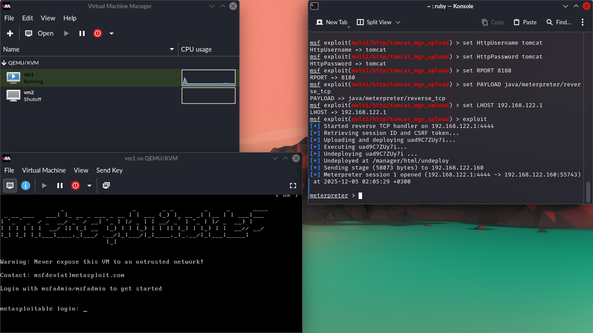
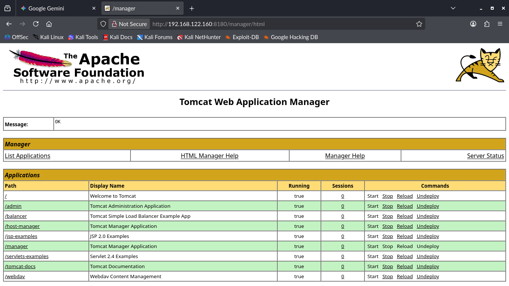

# EXPLOIT: Apache Tomcat Manager Upload RCE

## Goal
Gain Remote Code Execution (RCE) on the target host by exploiting weak, default credentials on the Apache Tomcat application server's Manager interface. This demonstrates a successful application server compromise.

## Methodology
The attack used Metasploit to leverage default credentials to gain administrative access to the Tomcat Manager, allowing a malicious payload to be uploaded and executed.

### Key Steps
1.  **Target Service:** Apache Tomcat on Port **8180** was identified.
2.  **Credential Discovery:** Default credentials of **`tomcat` / `tomcat`** were assumed and verified.
3.  **Exploitation:** Used the `exploit/multi/http/tomcat_mgr_upload` module to upload and deploy a malicious `.war` file containing a **`java/meterpreter/reverse_tcp`** payload.
4.  **Session:** A Meterpreter session was successfully established.

---

## Key Findings (Application Server Compromise)

### 1. Successful Administrative Access
The default configuration allowed high-privilege administrative access to the application server.

* **Credentials:** `tomcat` / `tomcat`

### 2. Privilege Level Achieved
The resulting shell runs under the Tomcat service account.

* **Initial Privilege:** **`Server username: tomcat`** (This is a low-privilege service account used by the web server).

### 3. Post-Exploitation Strategy
Since the privilege level is low, a local **Privilege Escalation** attack targeting the underlying Linux operating system would be required to gain a root shell.

---
