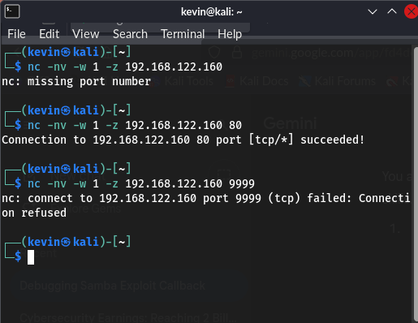

# Week 1: Systematic Enumeration Report

## Goal
Systematically map all open services, versions, and hidden directories on the target host (`192.168.122.160`) to create a comprehensive attack surface profile.

## Methodology
The primary methodology was **Service and Version Scanning** followed by **Web and Network Enumeration**.

### Key Commands Used
| Tool | Command | Purpose |
| :--- | :--- | :--- |
| **`nmap`** | `sudo nmap -sV -sC -p- 192.168.122.160` | Full TCP port scan combined with aggressive service version (`-sV`) and default script checks (`-sC`). |
| **`gobuster`** | `gobuster dir -u <URL> -w <wordlist>` | Directory brute-forcing to find hidden web applications. |
| **`enum4linux`** | `enum4linux -a 192.168.122.160` | Specialized enumeration for Samba and NetBIOS services to extract user lists and share information. |

---

## Key Findings (Actionable Intelligence)

The following services were found to be outdated, misconfigured, or contained known vulnerabilities.

### 1. Critical Service Versions
The most critical vulnerabilities were identified via Nmap/Netcat banner grabbing:
* SSH Service Version: **OpenSSH 4.7p1**. A very old version that may be vulnerable to username enumeration.

* **FTP Service Version:** **vsFTPd 2.3.4** (Port 21). This version contains a well-known, simple **backdoor** vulnerability.
* **Samba Service Version:** **Samba 3.0.20-Debian** (Ports 139, 445). This version is vulnerable to the **`usermap_script`** exploit, which allows for remote command execution.
* **SSH Service Version:** **OpenSSH 4.7p1**. A very old version that may be vulnerable to username enumeration.

### 2. Hidden Web Applications
Web enumeration revealed several non-standard directories (Status 301/302), confirming the presence of backend applications.
* Target Applications: Directories discovered included **/phpmyadmin**, **/dvwa**, and **/twiki**.

* **Target Applications:** Directories discovered included **/phpmyadmin**, **/dvwa**, and **/twiki**. These are all open-source applications that should be checked for default credentials or known exploits.
