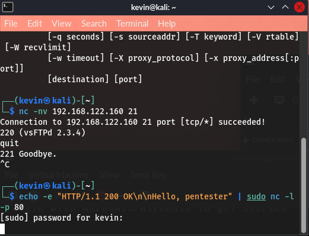

#  Week 2: Initial Exploitation Report

##  Goal
Gain the initial command shell (foothold) on the target host by exploiting a high-confidence vulnerability, demonstrating both manual and automated exploitation techniques.

## ðMethodology
The primary methodology was targeting the **vsFTPd 2.3.4 Backdoor** due to its reliability and the immediate **root** shell access it provides.

### Lab 2.1: Manual Exploitation (Netcat)
1.  **Vulnerability Confirmation:** Confirmed the presence of the vulnerable service banner via a simple Netcat connection to Port 21.
2.  **Exploit Execution:** Used a second Netcat session to connect to Port 21 and triggered the backdoor by submitting the malicious username (`USER user:)`).
3.  **Shell Acquisition:** Connected to the resulting **bind shell** that spawned on Port 6200 using a third Netcat session.

### Lab 2.2: Automated Exploitation (Metasploit)
Used `msfconsole` to load the `vsftpd_234_backdoor` exploit module, confirming Metasploit automates the manual backdoor steps.

### Lab 2.3: Reverse Shell Exploitation (Samba)
Successfully exploited the **Samba 3.0.20 `usermap_script`** vulnerability, demonstrating the use of a **Reverse Shell** (`cmd/unix/reverse_netcat`) which required setting the **LHOST** and **RHOSTS** variables correctly.

---

##  Key Findings (Successful Foothold)

### 1. Proof of Vulnerable Service
The target service was confirmed to be running the vulnerable version, which serves as the initial entry point:

* **Vulnerable Service:** **vsFTPd 2.3.4** (Port 21)

### 2. Privilege Level Achieved
The shell obtained from both the FTP and Samba exploits was confirmed to be the highest level of privilege, completing the exploitation phase.

* **Initial Foothold Privilege:** **`uid=0(root)`** (System Administrator).

### 3. Exploitation Knowledge Confirmation
The exploitation phase confirmed the ability to use **bind shells** (FTP) and **reverse shells** (Samba), validating proficiency in different payload delivery methods.

---
