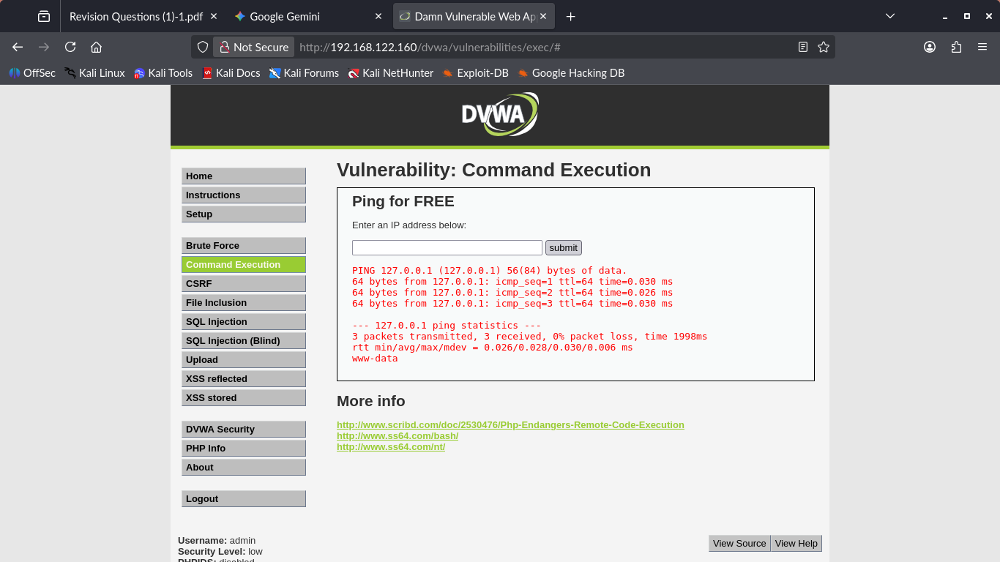
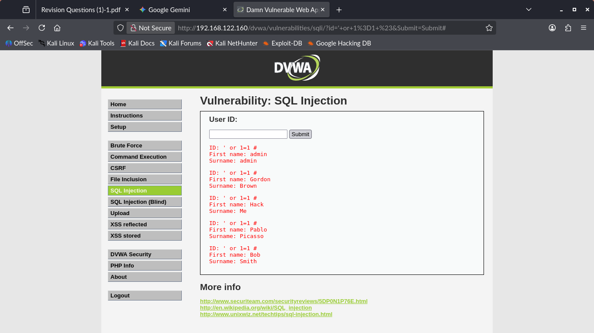

#  Week 4: Web Application Hacking Report

## Goal
Identify and exploit common web vulnerabilities within the Damn Vulnerable Web Application (DVWA) to steal data and execute remote commands.

## Methodology
Testing was conducted at the **Low Security Level** using injection techniques to bypass input validation and expose underlying system or database functions.

### Key Exploits Performed
| Vulnerability | Attack String | Finding |
| :--- | :--- | :--- |
| **Command Injection** | `127.0.0.1; whoami` | Executed as **www-data** |
| **SQL Injection** | `' or 1=1 #` | Dumped all database user records |

---

## Key Findings (Web Exploitation)

### 1. Command Injection (Remote Code Execution)
The application failed to sanitize user input, allowing the semicolon (`;`) command separator to execute unauthorized system commands.

* **Vulnerability Confirmed:** Remote Code Execution (RCE).
* **Privilege Level:** The web server runs as **`www-data`**, confirming a low-privilege shell is achievable via RCE.

### 2. SQL Injection (Credential & Data Theft)
By injecting the payload `' or 1=1 #`, the application was forced to return all user records from the database without requiring a valid User ID or password.

* **Vulnerability Confirmed:** Full database information disclosure.
* **Key Data Stolen:** Usernames (`admin`, `gordon`, `pablo`) and their corresponding password hashes.

---
